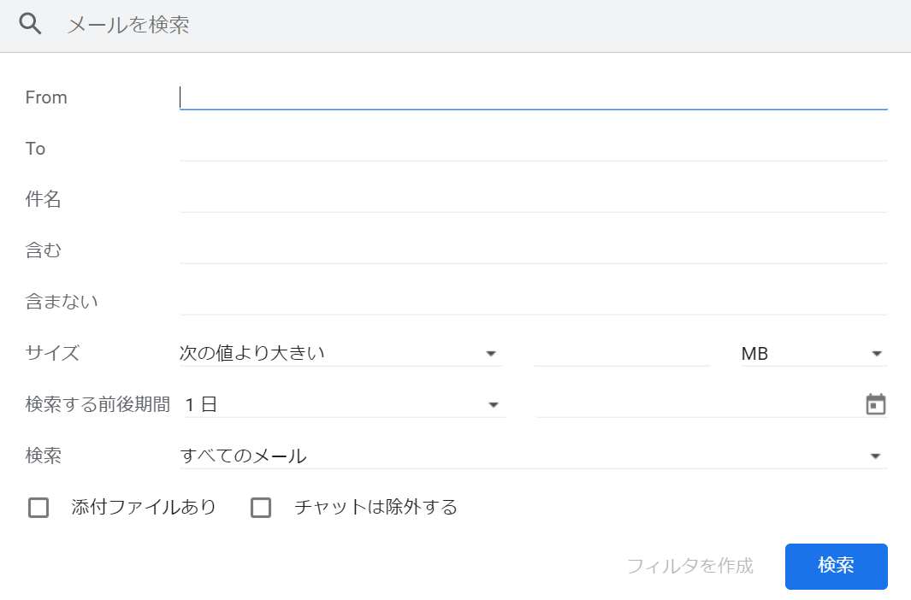
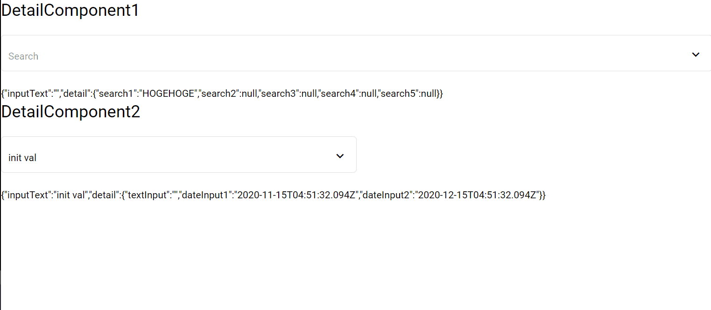

# なにこれ(JP)

詳細画面付き検索コンポーネントを作る実験。

👇Gmailの検索みたいなやつ。

汎用的なやつにしたかったのでComponentを設定して、Detailの中身を入れ替えれるようにした。

# 動作している様子

# InputWithDetail

This project was generated with [Angular CLI](https://github.com/angular/angular-cli) version 11.0.1.

## Development server

Run `ng serve` for a dev server. Navigate to `http://localhost:4200/`. The app will automatically reload if you change any of the source files.
